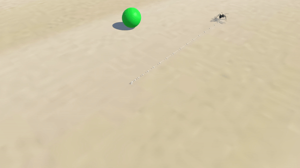

This academic research aims to explore different artificial intelligence techniques to simulate the behavior of living beings.

Techniques explored are state machines, steering behaviors, behavior trees, reinforcement learning, automated planners, fuzzy logic and utility maximization-based models. 

Experiment 1: Ant Colony

The objective of this experiment is to emulate how an ant colony behaves. The ants are represented as individual agents that respond directly to environmental stimuli. Their behavior is governed by a Finite State Machine with three states: 1) Explore, 2) Collect, 3) Attack.

The first state, Explore, is the default state for ants. In this state, an ant selects a random point in the environment and moves towards it. If the ant discovers a resource, it transitions to the Collect state and carries the resource back to the anthill. If the ant encounters a threat, it transitions to the Attack state.

In real life, ants communicate using chemical signals. To emulate this behavior, we use the Trace System. When an ant moves, it leaves behind a trail, which is a collection of points registered with specific information. This information can be neutral (white), indicating a resource collection (green), or indicating a threat (red). Each ant compares its position with all the traces to gather information about the environment. If an ant detects a trace from an ally who has found a resource, it will follow the trace to the resource. This emulates the phenomenon of ant highways. Additionally, if an ant detects that an ally is in danger, it will follow the trace to help its companion.

The simulation also incorporates a random resource generator based on a 3D grid and an algorithm that places resources over time in areas not occupied by ants or other resources.

The ant colony expands by gathering resources; every 5 units of resources collected results in the birth of a new ant.

The simulation is a closed system where each colony has specific stats, such as speed (blue colony) and attack damage (red colony). The simulation starts with an equal initial population for both colonies and ends when one of the colonies is extinguished.

